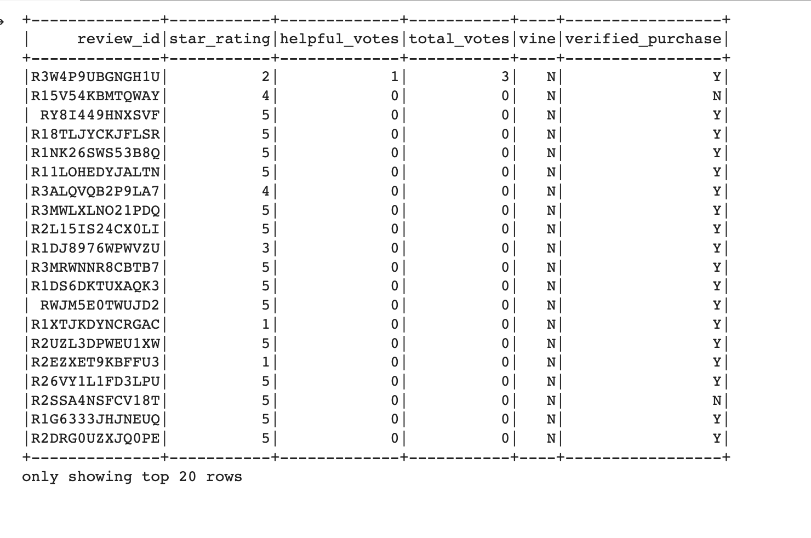

# Amazon Vine Program Analysis
The goal of this project is to create two technical analysis and also provide a written report on the analysis of the Amazon Vine program. 

# Overview
This project is about analyzing Amazon reviews written by members of the paid Amazon Vine program. The Amazon Vine program is a service that allows manufacturers and publishers to receive reviews for their products. Companies like SellBy pay a small fee to Amazon and provide products to Amazon Vine members, who are then required to publish a review.  Analysis is to determine if there is any bias toward favorable reviews from Vine members in the dataset. At the end, write a summary of the analysis for Jennifer to submit to the SellBy stakeholders.

## Perform ETL on Amazon Product Reviews

The customers table dataframe:

The products table dataframe:

The productsreview_id_table dataframe:

The vine table dataframe:

## Results 
The calculation of result required selecting only those reviews where number of votes greater than 20 and helpful votes divided by total_votes is equal to or greater than 50%

### Total Number Of Reviews:
#### Total Vine Reviews: 613

#### Total Non-Vine Reviews: 64,968 

### Total Number Of 5 Star Reviews:
#### Total Vine 5 Star Reviews: 200

#### Total Non-Vine 5 Star Reviews: 28,842 

### Percentage Of 5 Star Reviews:

#### Total Percentage of Vine 5 Star Reviews: 32.6%

#### Total Percentage of Non-Vine 5 Star Reviews: 44.3%

## Summary  
There is already positivity biased in the solution as filtering criteria required:
- Selecting only those reviews where number of votes greater than 20
- Helpful votes divided by total_votes is greater than 50%
- Rating is 5-star

It would have changed the percentage if we had increased the data set by:
- Reducing the number of votes greater than 20 to some lower value like 10
- Reduce helpful votes divided by total_votes to less than 50%
- Rating to 4-star and above

We can analyse other information per Star rating:
- Average / Mean
- Median
- Mode
